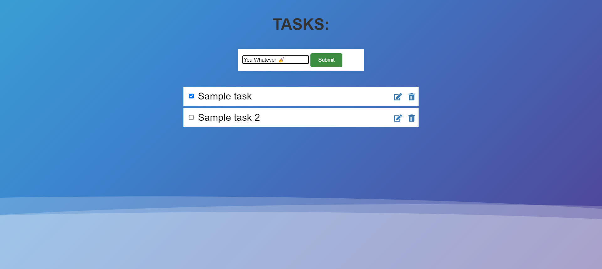
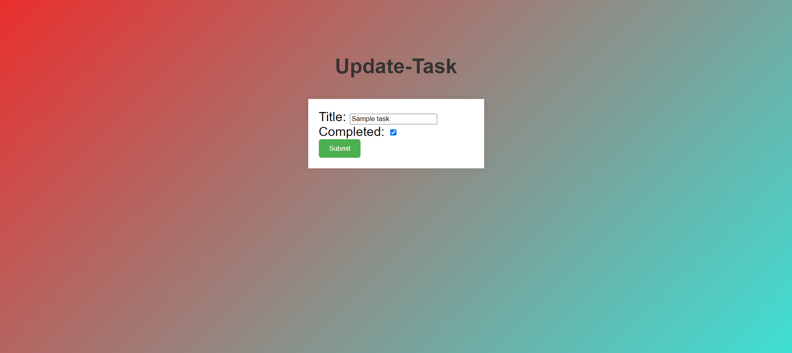
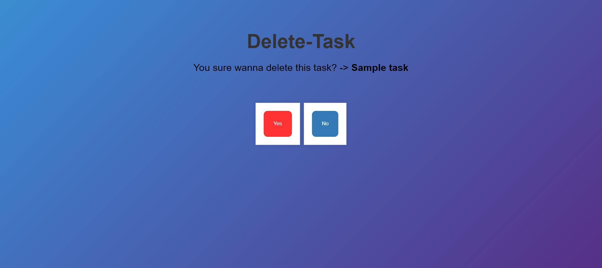

# To-Do List Web-App

A simple and elegant To-Do List web application built using Python Django, HTML, and CSS.

## Features

- CRUD Operations: Create, Read, Update, and Delete tasks.
- Checkbox: Mark tasks as complete.
- Confirmations: Asks for confirmation before deleting or updating tasks.
- Icons: Intuitive icons for update and delete actions.
- Beautiful Background: A calm and aesthetically pleasing , animated background.

## Screenshots

## Run Locally

Open the cmd prompt and write the following commands.

Step 1: `git clone https://github.com/malikahere/To-Do.git`

Step 2: `cd todo`

Step 3: `pip install -r requirements.txt`

Step 4: `python manage.py runserver`

Step 6: Open the browser and type `http://127.0.0.1:8000/`

## Author

- [@malikagarg](https://github.com/malikahere)
